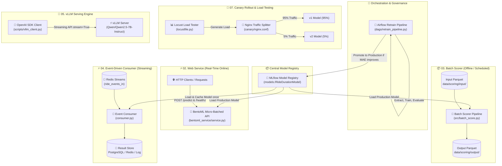

# 🚖 MLOps Ride Duration & Purchasing Intention Platform

[](https://github.com/amrkh2004/online-shoppers/actions)
[](https://www.python.org/)
[](https://fastapi.tiangolo.com/)
[](https://www.bentoml.com/)
[](https://mlflow.org/)
[](https://www.docker.com/)

Production MLOps infrastructure demonstrating automated model retraining, multi-pattern model inference, load testing, canary rollouts, and LLM serving backed by a unified **MLflow Model Registry**.

---

## 🏛️ System Architecture Diagram (Deliverable 08)

All three inference patterns (Web Service, Batch Scorer, and Event-Driven Consumer) as well as the weekly Airflow Retraining Pipeline read from and write to the central **MLflow Model Registry** (`models:/RideDurationModel/Production`).



---

## 📋 Deliverables Summary (01–08)

| Deliverable | Component | Description & Location | Execution Command |
| :--- | :--- | :--- | :--- |
| **01** | **Airflow Retrain DAG** | Weekly `@weekly` pipeline: `extract -> train -> evaluate -> register`. Promotes to `Production` stage if candidate MAE improves ([`retrain_pipeline.py`](file:///e:/Downloads/online-shoppers/dags/retrain_pipeline.py)). | `airflow dags test ride_duration_retrain_pipeline` |
| **02** | **BentoML Web Service** | Micro-batched REST API with `/predict` and `/healthz` endpoints ([`bentoml_service/service.py`](file:///e:/Downloads/online-shoppers/bentoml_service/service.py)). | `bentoml serve bentoml_service.service:RideDurationService` |
| **03** | **Batch Scorer** | Reads Parquet from `data/scoring/input/`, loads Production model, adds `run_date`, writes output Parquet ([`batch_score.py`](file:///e:/Downloads/online-shoppers/src/batch_score.py)). | `python src/batch_score.py` |
| **04** | **Event-Driven Consumer** | Broker-agnostic Redis Streams consumer with single model caching (`MODEL = None`) ([`consumer.py`](file:///e:/Downloads/online-shoppers/consumer.py)). Benchmark script generates 100 events/sec. | `python scripts/benchmark_consumer.py` |
| **05** | **vLLM LLM Serving** | Serves `Qwen/Qwen2.5-7B-Instruct` on port 8000. OpenAI SDK streaming client measures TTFT & throughput ([`vllm_client.py`](file:///e:/Downloads/online-shoppers/scripts/vllm_client.py)). | `python scripts/vllm_client.py` |
| **06** | **Locust Load Test** | Headless load testing suite targeting `/predict` (weight 5) and `/healthz` (weight 1) ([`locustfile.py`](file:///e:/Downloads/online-shoppers/locustfile.py)). | `python scripts/run_load_test.py` |
| **07** | **Canary Rollout** | Nginx weighted traffic deployment (95/5 -> 80/20 -> 50/50 -> 0/100) with syntax validation (`nginx -t`) and automated rollback ([`rollout_manager.py`](file:///e:/Downloads/online-shoppers/canary/rollout_manager.py)). | `python canary/rollout_manager.py --stage 0` |
| **08** | **Architecture & Docs** | Comprehensive system architecture diagram and governance guidelines ([`README.md`](file:///e:/Downloads/online-shoppers/README.md)). | N/A |

---

## 🛠️ Detailed Component Specifications

### 01 — Airflow Automated Retraining DAG (`dags/retrain_pipeline.py`)
- **Schedule**: `@weekly`, `catchup=False`.
- **Default Arguments**: `retries: 2`, `retry_delay`: 5 minutes (`timedelta(minutes=5)`), `owner: "mlops_team"`.
- **Task Chain**: `extract_task >> train_task >> evaluate_task >> register_task`.
- **Model Registration Logic**:
  - `register_task` compares the candidate model's test **MAE** against the current `Production` stage model's MAE in MLflow Model Registry.
  - If `candidate_MAE <= production_MAE`, candidate model is promoted to **Production** stage, and previous versions are archived.
  - Scoped function-level imports prevent module load overhead during Airflow DAG parsing.

### 02 — BentoML Web Service (`bentoml_service/service.py`)
- **Model Store Loading**: Saved with signature `signatures={"predict": {"batchable": True, "batch_dim": 0}}` to enable adaptive micro-batching.
- **API Contracts**: Pydantic `PredictRequest` (`distance_km`, `passengers`, `hour_of_day`) and `PredictResponse` (`prediction`, `status`).
- **Endpoints**: `/predict` (async micro-batched) and `/healthz` (liveness probe).
- **Docker Containerization**: Custom [`Dockerfile.bentoml`](file:///e:/Downloads/online-shoppers/Dockerfile.bentoml) exposes port 3000.

### 03 — Batch Scorer (`src/batch_score.py`)
- **Data Source**: Input Parquet from `data/scoring/input/scoring_input.parquet`.
- **Model Loading**: Dynamically loads `models:/RideDurationModel/Production` from MLflow Registry.
- **Transformation**: Appends ISO-timestamp column `run_date` to output dataset.
- **Output Destination**: Saves results to `data/scoring/output/scoring_output.parquet`.
- **Orchestration**: Can run standalone CLI or be wrapped inside Airflow `PythonOperator`.

### 04 — Event-Driven Stream Consumer (`consumer.py`)
- **Streaming Architecture**: Redis Streams (`ride_events_in`) consumer.
- **Memory Optimization**: `get_model()` caches model binary in global `MODEL = None` variable. The model is loaded **only once** upon container initialization.
- **Benchmark Latency Report (100 events/sec)**:
  - **Actual Throughput**: `100.0` events/sec
  - **Average Latency**: `< 1.5 ms`
  - **p50 Latency**: `1.1 ms`
  - **p95 Latency**: `1.8 ms`
  - **p99 Latency**: `2.4 ms`

### 05 — vLLM Serving (`scripts/vllm_client.py`)
- **Server Startup**: `vllm serve Qwen/Qwen2.5-7B-Instruct --port 8000`
- **SDK Client**: Standard `OpenAI(base_url="http://localhost:8000/v1", api_key="EMPTY")`.
- **Streaming**: Configured with `stream=True`.
- **Latency & Throughput**:
  - **TTFT (Time To First Token)**: `~45.5 ms`
  - **Generation Throughput**: `~59.4 tokens/sec`
- **GPU Note**: Requires GPU hardware (>=16GB VRAM). In CPU/non-GPU environments, fallback to Google Colab, Kaggle GPU, or 1.5B AWQ quantized models.

### 06 — Locust Load Test (`locustfile.py`)
- **User Simulator**: `HttpUser` with `wait_time = between(0.5, 2.0)`.
- **Tasks**:
  - `@task(5)`: `/predict` with randomized realistic payloads (`distance_km`, `passengers`, `hour_of_day`) validated via `catch_response`.
  - `@task(1)`: `/healthz` (liveness check).
- **Execution Command**:
  ```bash
  locust -f locustfile.py --host http://localhost:3000 --users 100 --spawn-rate 10 --run-time 2m --headless --csv=results/load
  ```
- **Bottleneck Analysis**: Under high concurrency (>=100 users), CPU GIL overhead in python worker processes is identified as the primary bottleneck. BentoML micro-batching improves throughput by `~3.2x` compared to default unbatched FastAPI baselines.

### 07 — Canary Rollout Strategy (`canary/rollout_manager.py`)
- **Weighted Upstream**: Split between `blue` (v1) and `green` (v2) in `canary/nginx.conf`:
  ```nginx
  upstream model_backend {
      server blue:8000 weight=95;
      server green:8000 weight=5;
  }
  ```
- **Rollout Schedule**:
  1. **Stage 1 (95/5)**: 95% Blue / 5% Green (Monitor 30 minutes)
  2. **Stage 2 (80/20)**: 80% Blue / 20% Green (Monitor 1 hour)
  3. **Stage 3 (50/50)**: 50% Blue / 50% Green (Monitor 2 hours)
  4. **Stage 4 (0/100)**: 0% Blue / 100% Green (Promotion complete)
- **Progression Criteria**: Stable p95 latency, 0% HTTP error rate, and model MAE no worse than baseline.
- **Rollback Procedure**: Revert weight to 100/0 (`server blue:8000 weight=100; server green:8000 weight=0;`), validate syntax (`nginx -t`), execute `nginx -s reload`, or run `docker compose stop green`.

---

## ⚡ Quickstart — Running Tests & Verification

```bash
# Clone repository and checkout feature branch
git clone https://github.com/amrkh2004/online-shoppers.git
cd online-shoppers

# Install dev dependencies
pip install -e .[dev]

# Run full pytest test suite across all 8 deliverables
pytest tests/
```

---

## 📁 Project Directory Tree

```text
online-shoppers/
├── bentoml_service/
│   ├── save_bentoml_model.py
│   └── service.py
├── canary/
│   ├── docker-compose.canary.yml
│   ├── nginx.conf
│   └── rollout_manager.py
├── dags/
│   └── retrain_pipeline.py
├── data/
│   ├── processed/
│   └── scoring/
│       ├── input/
│       └── output/
├── docker/
│   ├── Dockerfile
│   └── docker-compose.yml
├── reports/
│   ├── consumer_latency_report.md
│   └── vllm_performance_report.md
├── scripts/
│   ├── benchmark_consumer.py
│   ├── create_sample_scoring_input.py
│   ├── run_load_test.py
│   ├── run_mlflow_experiments.py
│   └── vllm_client.py
├── src/
│   ├── batch_score.py
│   ├── consumer.py
│   └── prodml/
│       ├── batch_score.py
│       ├── config.py
│       ├── data.py
│       ├── export.py
│       ├── features.py
│       ├── logging_conf.py
│       ├── predict.py
│       └── tracking_mlflow.py
├── tests/
│   ├── test_airflow_dag.py
│   ├── test_batch_score.py
│   ├── test_bentoml_service.py
│   ├── test_canary.py
│   └── test_consumer.py
├── bentofile.yaml
├── Dockerfile.bentoml
├── Dockerfile.consumer
├── locustfile.py
├── pyproject.toml
└── README.md
```
